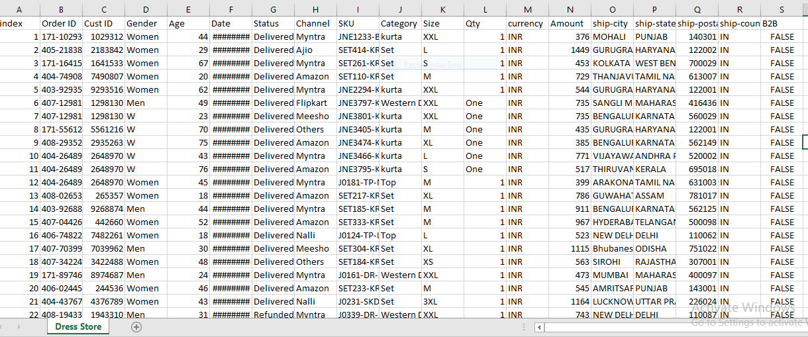

### Project Title:
Excel- Online Dress Store Data Analysis

#### Objective:
Online Dress Store wants to create an annual sales report for 2023. So that, their customers can be understood by the owner, and more sales can be grown in 2023.

#### Raw Data: 
Excel workbook “Raw Data” contains the data of the Dress Store.

![Raw data] 

#### Complete data analytics project:
The Excel workbook named “Dress Store Data Analysis” contains data that has been cleaned, processed, and analyzed, and includes dashboard creation.

#### Project Steps:

##### 1. Data Cleaning:
* Import Data: Loading data from Excel file into Excel.
* Identify and Handle Missing Values: Using functions like IFERROR, ISNA, and VLOOKUP to find and fill or remove missing data.
* Remove Duplicates: Utilizing Excel’s built-in "Remove Duplicates" feature.
* Data Replacing: Replacing inaccurate data with suitable values.

##### 2. Data Processing:
* Data Transformation: Using formulas to create "Age Group" and "Month" columns.
* Filtering and Sorting: Appling filters and sorting data to identify key trends.
* Pivot Tables: Creating Pivot Tables for summarizing data and deriving insights.

##### 3. Data Analysis:
* Data Visualization: Creating charts (bar, pie) to visualize data.
* Trend Analysis: Utilizing linear regression and trendlines to analyze trends over time.

##### 4. Report ( Interactive Dashboard) Creation:
* Design Layout: Planning the dashboard layout for clarity and ease of use.
* Interactive Elements: Adding slicers for PivotTables.
* Final Touches: Ensuring the dashboard is user-friendly, visually appealing, and provides actionable insights.

#### Deliverables:
* Cleaned and processed data files.
* Analytical insights with visualizations.
* Interactive dashboard showcasing key findings and metrics.

#### Data analysis depending on various aspects:
##### Comparing sales and orders using a single chart. The month with the highest sales and orders is identified.
##### Women purchased more than men in 2023.
##### Different order status in 2023.
##### Listing top 5 states contributing to the sales
##### Relation between age and gender based on the number of orders
##### The channel contributing to maximum sales is identified.

#### Store Annual Report 2024:
##### Annual report for all months, channels, and categories.
##### Annual report for all channels and categories for each month.
##### Annual report for all months and categories for each channel.
##### Annual report for all months and channels for each category.

#### Sample Insights:
* Women are more likely to buy compared to men (~64%)
* Maharashtra, Karnataka and Uttar Pradesh are the top 3 states (~35%) 
* The adult age group (30-49 years) is max contributing (~50%)
* Amazon, Flipkart, and Myntra channels are max contributing (~80%)
  

#### Final Conclusion to improve Online Dress Store sales:
* This project demonstrates a full cycle of data analytics in Excel, from initial data cleaning to the creation of an interactive dashboard. By following these steps, the data analysts of Online Dress Store can derive meaningful insights and present them effectively to stakeholders.
* Targeting women customers of the age group (30-49 years) living in Maharashtra, Karnataka, and Uttar Pradesh by showing ads/offers/coupons available on Amazon, Flipkart, and Myntra is a way to reach potential customers effectively.

